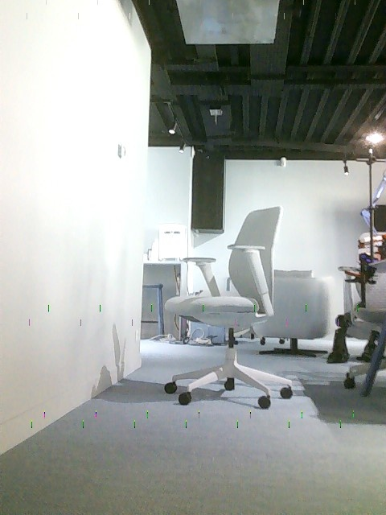
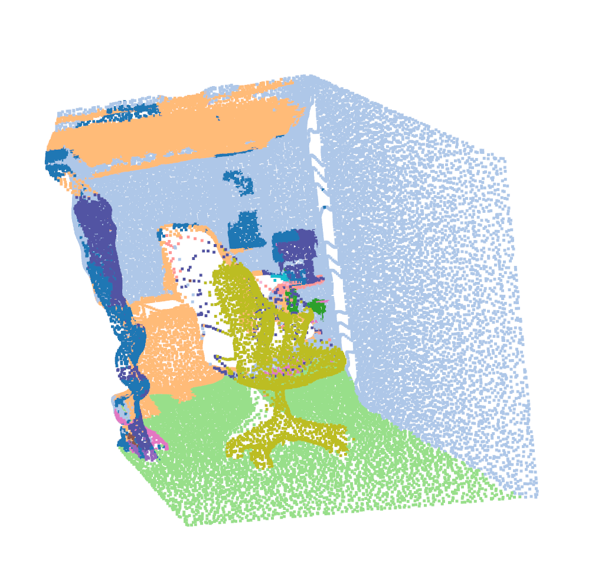
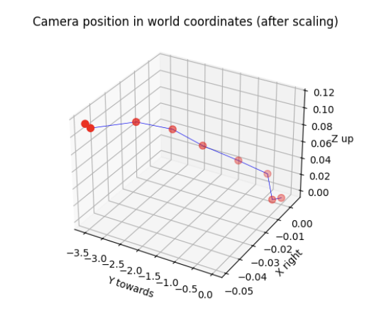

# <p style="text-align:center;">Using CV models: VGGT-Sonata pipeline for zero-shot robotics spatial navigation</p>
## Overview:
This repository proposes a pipeline that enables 3D scene reconstruction from one single image or a video, with a simple RBG camera predict object depth, and achieve semantic segmentation of objects in the scene. It does this by running **[VGGT](https://github.com/facebookresearch/vggt.git)** model inference, and feeds the output into **[Sonata](https://github.com/facebookresearch/sonata.git)** which does the segmentation. Then in the repository, we use Lekiwi robot from LeRobot Hugging Face to autonomously have lekiwi navigate to any given target object. 

This pipeline effectively works on another robots with either cartesian coordinate system, or like lekiwi with planar coordinate system with polar orientation. However, to operate on Cartesian system, some code modification needs to be carried out.

### Demo results:
The pipeline reconstructs indoor scene taken from lekiwi's camera with clear segmentation of different furnitures, which are labeled in ```legend.html```. Lekiwi then receives inference result and travels to the right object with accurate distance, all in zero shot. 
<p align="center">
  
  
</p>

Navigation can be also be tracked by plotting the camera extrinsic parameters to visualise the camera translation. We will explain how to enable this functionality in sections that follow. The demo video shows movments executed by lekiwi is visible at ```readme-imgs/demo.mp4```.
<p align="center">
  
</p>

## Installation:
Clone this repository to local by running:
```
git clone https://github.com/yyypsycheguy/VGGT-Sontata.git
cd VGGT-Sonata
```
### Setup for [VGGT](https://github.com/facebookresearch/vggt.git) -- Visual Geometry Grounded Transformer
Before running the pipeline, remember to set up dependencies for VGGT and Sonata, as well as lerobot. For now, we are just setting up virtual environments and installing packages.The repository is separated into three parts: VGGT, Sonata and lerobot, respectively have their own environments and dependencies. More detailed installation guide for trouble shooting can be found in their original repositories, but it is enough by following the commands down below for running the pipeline.
```
cd vggt
uv venv .venv
source .venv/bin/activate
uv pip install -r requirements.txt
uv pip install -r requirements_demo.txt

# Install a package in the new virtual environment if needed
uv pip install ruff
```
Also create an image folder for later use:
```
cd vggt
mkdir images
```

### Setup for [Sonata](https://github.com/facebookresearch/sonata.git) 
Moving on to setup Sonata. From root directory:
```
cd sonata
uv venv sonata-venv
source sonata-venv/bin/activate

# Ensure Cuda and Pytorch are already installed in your local environment

# CUDA_VERSION: cuda version of local environment (e.g., 124), check by running 'nvcc --version'

# TORCH_VERSION: torch version of local environment (e.g., 2.5.0), check by running 'python -c "import torch; print(torch.__version__)"'

uv pip install spconv-cu${CUDA_VERSION}
uv pip install torch-scatter -f https://data.pyg.org/whl/torch-{TORCH_VERSION}+cu${CUDA_VERSION}.html

# install flash attention
uv pip install torch psutil packaging ninja
uv pip install git+https://github.com/Dao-AILab/flash-attention.git --no-build-isolation
uv pip install huggingface_hub timm

# (optional, or directly copy the sonata folder to your project)
uv python setup.py install

uv pip install open3d fast_pytorch_kmeans psutil numpy==1.26.4  # currently, open3d does not support numpy 2.x
```
Please refer to original [Sonata](https://github.com/facebookresearch/sonata.git) repository for trouble shooting.

### Setup for [lerobot directory](https://huggingface.co/docs/lerobot/installation)

If first time setting up lekiwi please refer to Hugging Face Lerobot installation guide first for details. Lekiwi works by having a leader arm guiding the motions of the follower arm with mobile base. On your laptop, you have to first SSH into the Raspberry Pi on the follower arm mobile base, as well as connect the laptop to the leader arm to start teleoperating. We also need to teleoperate it, though the pipeline disregards actions received from the leader arm, because we would only need the follower arm to raise straight up, and travel spontaneously the distance infered by VGGT-Sonata.

To teleoperate and run spatial navigation of this repository, first ensure you have installed lerobot by either following the original guide or on your laptop:
cd into lerobot directory and create a virtual environment with Python 3.10, using Miniconda
```
cd lerobot
conda create -y -n lerobot python=3.10
conda activate lerobot
```
When using miniconda, install ffmpeg in your environment:
```
conda install ffmpeg -c conda-forge
```
Then, install the library in editable mode. This is useful if you plan to contribute to the code.
```
pip install -e .
```
Core Library: Install the base package with:
```
pip install lerobot
```
Lekiwi contains an SO100 arm (follower arm) so for SO100/SO101/Moss install the Feetech SDK.
```
pip install -e ".[feetech]"
pip install -e ".[lekiwi]"
```

Now you have lerobot setup on your local machine, you have to do the same of the Raspberry Pi by repeating the same instructions as above. In addition if you need to setup the hardware, please refer to [lewiki](https://huggingface.co/docs/lerobot/lekiwi) operation guide.

## Parameter modification
There are three main files respectively for VGGT, Sonata inference and lekiwi teleoperation. Let's dive into each one to make sure some parameters are correct according to your own hardware.

1. In lekiwi directory, make sure you have set the correct remote_ip and port in examples/lekiwi/teleoperate.py. 

2. If you are using other machines/robots to take input pictures, you have to modify this parameter at:
    ```
    cd sonata/inference_visualize-sonata.py
    ```
    which is the Sonata inference file. You need to manually measure frame_dis:
    ```
    frame_dis = 1.45 # no need to change if you are using lekiwi, using arm pose proposed by the pipeline
    ```
    Which is the distance of the blind angle from camera to the bottom of video frame. Think about when you dont see the ground immediately below in your video until some distance away. It is 1.45m measured from le kiwi with extended arm; around 3.1m for iPhone video recording, held at 150cm above the ground.

3. Modify the furniture you would like to track in the view of camera, and in the proposed categories of Sonata. 
    ```
    target = "chair"
    ```
    Categories proposed by Sonata are marked in ``` legend.html ```.

4. We also propose a functionality to view the camera trajectory: eg. robot translation. It is located at:
    ```
    cd vggt/vggt_inference_floor.py
    ```
    Extrinsic tracks camera position as a series of tensor. You can then plot it to visualise.
    ```
    # print(f't cam-to-world scaled extrinsics: {t_extrinsic_scaled}') # uncomment if would like to visualise
    ```
    ```t_extrinsic_scaled[0]``` column refers to x-axis (right), ```t_extrinsic_scaled[1]``` being y-axis (towards), ```t_extrinsic_scaled[2]``` being z-axis (up).


## Running the pipeline: 
We shall run the pipeline locally as well as using the Raspberry pi on lekiwi. SSH into your Pi, run this command:
```
cd lerobot
conda activate lerobot

# start teleoperating
python -m lerobot.robots.lekiwi.lekiwi_host --robot.id=my_awesome_kiwi
```
On your laptop cd into the folder containing Sonata, this is where the automation script is located. On your terminal run: 
```
# add script into your executable
chmod +x bash-command.sh

# run
./bash-command.sh 
```
This takes photo inputs from your lekiwi robot, runs inference with vggt & sonata, gives the input calibrated distance for lekiwi to execute.

