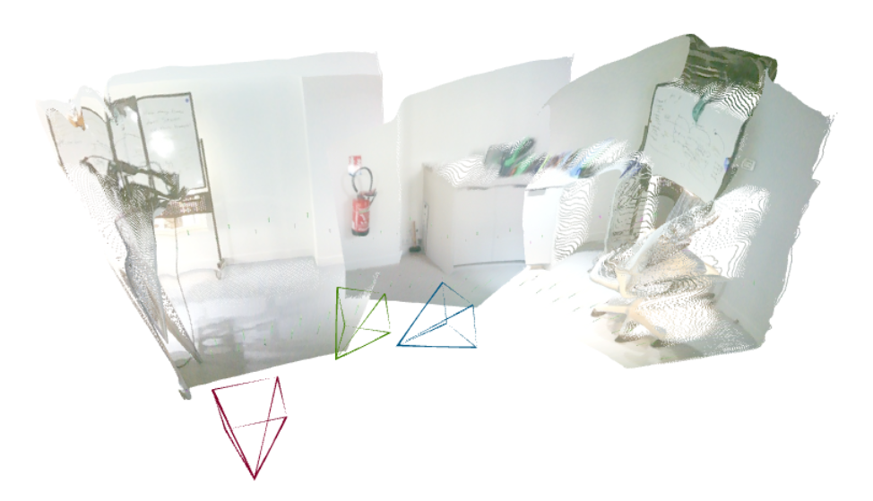
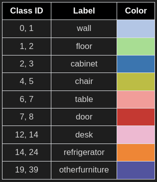
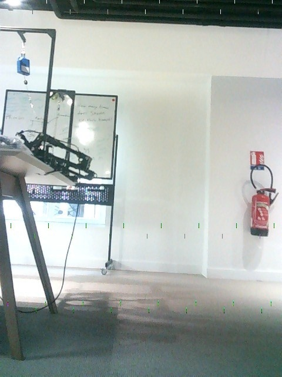
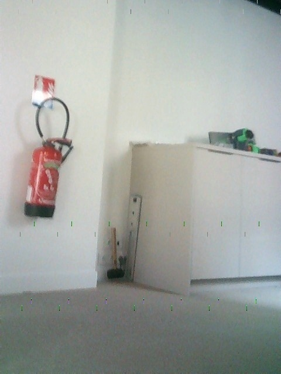
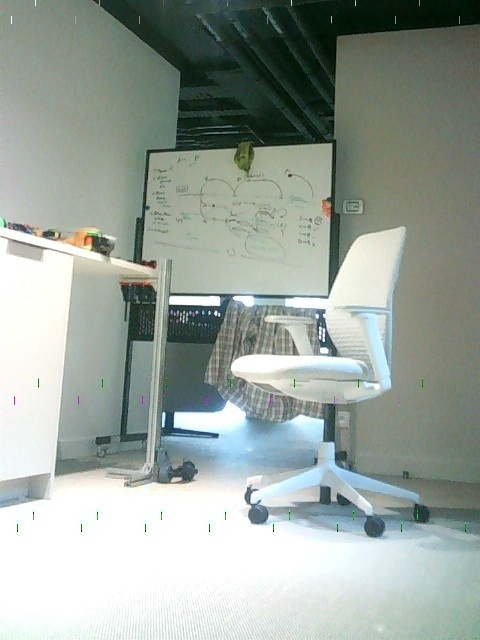

# <p style="text-align:center;">Using CV models: VGGT-Sonata pipeline for zero-shot robotics spatial navigation</p>
## Overview
Reconstructing a 3D scene by scanning the environment is applicable in robotics simulation, and potentially enables zero-shot navigation. **[VGGT: Visual Geometry Grounded Transformer](https://github.com/facebookresearch/vggt.git)**  achieves this by predicting scene depth directly from RGB images—without requiring known camera parameters, in a faster and inexpensive way than traditional methods like DUSt3R. 

This repository proposes a pipeline that enables 3D scene reconstruction from one single image or a video, with a simple RBG camera predict object depth, and achieve semantic segmentation of objects in the scene. It does this by running **[VGGT](https://github.com/facebookresearch/vggt.git)** model inference, and feeds the output into **[Sonata](https://github.com/facebookresearch/sonata.git)** which does the segmentation. Then in the repository, we use Lekiwi robot from LeRobot Hugging Face to autonomously have lekiwi navigate to any given target object. 

This pipeline effectively works on another robots with either cartesian coordinate system, or like lekiwi with planar coordinate system with polar orientation. However, to operate on Cartesian system, some code modification needs to be carried out.

### Demo results
The pipeline reconstructs indoor scene taken from lekiwi's camera with clear segmentation of different furnitures, which are labeled in ```legend.html```. Lekiwi then receives inference result and travels to the right object with accurate distance, all in zero shot. 

<table>
<tr>
  <td></td>
  <td></td>
  <td></td>
</tr>
</table>


Navigation can be also be tracked by plotting the camera extrinsic parameters to visualise the camera translation. We will explain how to enable this functionality in Annex that follows. A demo video redording how lekiwi travels to the target. 

<div style="text-align:center;">
  
</div>


## Installation
Clone this repository to local by running:
```
git clone https://github.com/yyypsycheguy/VGGT-Sontata.git
cd VGGT-Sonata
```
### Setup for [VGGT](https://github.com/facebookresearch/vggt.git) -- Visual Geometry Grounded Transformer
Before running the pipeline, remember to set up dependencies for VGGT and Sonata, as well as lerobot. For now, we are just setting up virtual environments and installing packages.The repository is separated into three parts: VGGT, Sonata and lerobot, respectively have their own environments and dependencies. More detailed installation guide for trouble shooting can be found in their original repositories, but it is enough by following the commands down below for running the pipeline.
```bash
cd vggt
uv venv .venv
source .venv/bin/activate
uv pip install -r requirements.txt
uv pip install -r requirements_demo.txt

# Install a package in the new virtual environment if needed
uv pip install ruff
```
Also create an image folder for later use:
```bash
cd vggt
mkdir images
```

### Setup for [Sonata](https://github.com/facebookresearch/sonata.git) 
Moving on to setup Sonata. From root directory:
```bash
cd sonata
uv venv sonata-venv
source sonata-venv/bin/activate

# Ensure Cuda and Pytorch are already installed in your local environment

# CUDA_VERSION: cuda version of local environment (e.g., 124), check by running: 
nvcc --version

# TORCH_VERSION: torch version of local environment (e.g., 2.5.0), check by running:
python -c "import torch; print(torch.__version__)"

# Replace ${} with version you are using
uv pip install spconv-cu${CUDA_VERSION}
uv pip install torch-scatter -f https://data.pyg.org/whl/torch-{TORCH_VERSION}+cu${CUDA_VERSION}.html

# install flash attention
uv pip install torch psutil packaging ninja
uv pip install git+https://github.com/Dao-AILab/flash-attention.git --no-build-isolation
uv pip install huggingface_hub timm

# (optional, or directly copy the sonata folder to your project)
uv python setup.py install

uv pip install open3d fast_pytorch_kmeans psutil numpy==1.26.4  # currently, open3d does not support numpy 2.x
```
Please refer to original [Sonata](https://github.com/facebookresearch/sonata.git) repository for trouble shooting.

### Setup for [lerobot directory](https://huggingface.co/docs/lerobot/installation)

If first time setting up lekiwi please refer to Hugging Face Lerobot installation guide first for details. Lekiwi works by having a leader arm guiding the motions of the follower arm with mobile base. On your laptop, you have to first SSH into the Raspberry Pi on the follower arm mobile base, as well as connect the laptop to the leader arm to start teleoperating. We also need to teleoperate it, though the pipeline disregards actions received from the leader arm, because we would only need the follower arm to raise straight up, and travel spontaneously the distance infered by VGGT-Sonata.

To teleoperate and run spatial navigation of this repository, first ensure you have installed lerobot by either following the original guide or on your laptop:
cd into lerobot directory and create a virtual environment with Python 3.10, using Miniconda
```bash
cd lerobot
conda create -y -n lerobot python=3.10
conda activate lerobot
```
When using miniconda, install ffmpeg in your environment:
```bash
conda install ffmpeg -c conda-forge
```
Then, install the library in editable mode. This is useful if you plan to contribute to the code.
```bash
pip install -e .
```
Core Library: Install the base package with:
```bash
pip install lerobot
```
Lekiwi contains an SO100 arm (follower arm) so for SO100/SO101/Moss install the Feetech SDK.
```bash
pip install -e ".[feetech]"
pip install -e ".[lekiwi]"
```

Now you have lerobot setup on your local machine, you have to do the same of the Raspberry Pi by repeating the same instructions as above. In addition if you need to setup the hardware, please refer to [lewiki](https://huggingface.co/docs/lerobot/lekiwi) setup guide.


## Workflow walk through
There are four main files need to be executed in order respectively for lekiwi image collecting teleoperation, VGGT inference, Sonata inference and lekiwi navigation. Let's dive into each one, walk through how to execute them, and make sure some parameters are correct according to your own hardware.

### 1. Collect images by teleoperating Le Kiwi:
First step is to collect images with the camera on le kiwi wrist to even have images stored in the image folder for VGGT inference. Le Kiwi is designed to run by being teleoperated, which means it needs to be connected vis SSH as well as by running the teleoperate file locally. Therefore, we need to collect images by teleoperating le Kiwi. Feel free to move it around, make sure you take pictures enough for inference.

Get into the directory containing the teleoperation file ```lerobot/examples/lekiwi/teleoperate_collect_imgs.py```:
```bash
cd lerobot
conda activate lerobot
```
Make sure you have set the correct remote_ip that belongs to your Raspberry Pi, as well as port for example:
```python
robot_config = LeKiwiClientConfig(remote_ip="172.18.134.136", id="my_lekiwi")
```
If you have questions on how to get the ip address and SSH into the Pi: connect it using HDMI for the first time:
Get Wired IP (First Connection via HDMI Cable)
```bash
ip addr
```
list connected devices to find your Pi’s IP:
```bash
arp -a
# or scan the subnet, replace the sample address with your pi's
nmap -sn 192.168.1.0/24
```
Inside the Pi: Check Its Current IPs:
```bash
hostname -I
```
This will show something like: 
```bash
192.168.1.50 172.18.134.136
```
the first ip is ethernet, the second is the pi's via wifi.
If Wi-Fi isn’t configured yet, do:
```bash
sudo nano /etc/wpa_supplicant/wpa_supplicant.conf
```
This opens the configuration file, add or modify with this format:
```bash
country=US # modify
ctrl_interface=DIR=/var/run/wpa_supplicant GROUP=netdev
update_config=1

network={
  ssid="YourWiFiName" # modify
  psk="YourWiFiPassword" # modify
}
```
Reboot the Pi to check its ip address through wifi:
```bash
sudo reboot
```
SSH back over ethernet (cable):
```bash
hostname - I
ip addr show wlan0
```
Now replace the ethernet ip with wirelss ip:
```bash
ssh pi@192.168.1.80 # modify into your pi's ip
```

Then on pi terminal run this command to prepare for teleoperation:
```bash
cd lerobot
conda activate lerobot

# start teleoperating
python -m lerobot.robots.lekiwi.lekiwi_host --robot.id=my_awesome_kiwi
```
At the same time on your laptop:
```bash
cd lerobot
conda activate lerobot

python examples/lekiwi/teleoperate_collect_imgs.py
```

You can modify the rate of image taking in the file:
```
busy_wait(max( 1.0/ FPS - interval, 0.0))  # modify FPS value, eg. FPS=1 takes 1 picture per second
```
The images taken are stored in ```vggt/images``` directory. Beware to make sure the floor is in view of all images. For a 4090 GPU the maximum number of images that can run for inference is around 5-6 before encountering CUDA out of memory. Usually 3 images with enough view is enough to cover modelling of a corner of hallway.
<table>
<tr>
  <td></td>
  <td></td>
  <td></td>
</tr>
</table>


### 2. Running VGGT inference:
VGGT inference is essential to construct the 3D point cloud predicted from your images. Its inference ouputs world points of which we then transform into input format needed for Sonata, the immediate step that follows.
```bash
cd vggt
source .venv/bin/activate
uv run vggt_inference.py
```
which takes images in ```vggt/images``` to run inference, then stores the predicted 3d point clouds as a pytorch tensor in ```vggt/predictions.pt```.

Camera extrinsics is also saved as tensor in ```extrinsics.pt`` for later use. Extrinsics store the camera location and the direction of camera that is pointing, which is useful to track camera positions when each images are taken.

### Running Sonata inference: 
Sonata inference is responsible of sementic segementation of different objects in the scene. Recall in the demo sample point clouds that represents chair is colored in green etc. The model is trained in indoor furniture dataset with categories found in ```legend.html```. 

<table border="1" cellpadding="6" cellspacing="0" style="border-collapse: collapse; font-family: Arial, sans-serif;">
  <thead style="background-color:rgb(0, 0, 0);">
    <tr>
      <th>Class ID</th>
      <th>Label</th>
      <th>Color</th>
    </tr>
  </thead>
  <tbody>
    <tr><td>0, 1</td><td>wall</td><td style="background-color: rgb(174,199,232);"></td></tr>
    <tr><td>1, 2</td><td>floor</td><td style="background-color: rgb(152,223,138);"></td></tr>
    <tr><td>2, 3</td><td>cabinet</td><td style="background-color: rgb(31,119,180);"></td></tr>
    <tr><td>3, 4</td><td>bed</td><td style="background-color: rgb(255,187,120);"></td></tr>
    <tr><td>4, 5</td><td>chair</td><td style="background-color: rgb(188,189,34);"></td></tr>
    <tr><td>5, 6</td><td>sofa</td><td style="background-color: rgb(140,86,75);"></td></tr>
    <tr><td>6, 7</td><td>table</td><td style="background-color: rgb(255,152,150);"></td></tr>
    <tr><td>7, 8</td><td>door</td><td style="background-color: rgb(214,39,40);"></td></tr>
    <tr><td>8, 9</td><td>window</td><td style="background-color: rgb(197,176,213);"></td></tr>
    <tr><td>9 ,10</td><td>bookshelf</td><td style="background-color: rgb(148,103,189);"></td></tr>
    <tr><td>10, 11</td><td>picture</td><td style="background-color: rgb(196,156,148);"></td></tr>
    <tr><td>11, 12</td><td>counter</td><td style="background-color: rgb(23,190,207);"></td></tr>
    <tr><td>12, 14</td><td>desk</td><td style="background-color: rgb(247,182,210);"></td></tr>
    <tr><td>13, 16</td><td>curtain</td><td style="background-color: rgb(219,219,141);"></td></tr>
    <tr><td>14, 24</td><td>refrigerator</td><td style="background-color: rgb(255,127,14);"></td></tr>
    <tr><td>15, 28</td><td>shower curtain</td><td style="background-color: rgb(158,218,229);"></td></tr>
    <tr><td>16, 33</td><td>toilet</td><td style="background-color: rgb(44,160,44);"></td></tr>
    <tr><td>17, 34</td><td>sink</td><td style="background-color: rgb(112,128,144);"></td></tr>
    <tr><td>18, 36</td><td>bathtub</td><td style="background-color: rgb(227,119,194);"></td></tr>
    <tr><td>19, 39</td><td>otherfurniture</td><td style="background-color: rgb(82,84,163);"></td></tr>
  </tbody>
</table>


```bash
cd Sonata
source sonata-venv/bin/activate
uv run sonata_inference.py
```
Enables 3d point cloud segmentation by taking input from ```predictions.pt```. You shall see the predicted categories in terminal output after running inference. The predictions is save in dictionary format in ```results.pt```.

To visualise the segmentation, run:
```bash
cd Sonata
source sonata-venv/bin/activate 
uv run sonata_visualise.py
```
These two are executed by separate files loading the same point cloud tensor. 

### 3. Comppute scale factor
A drawback of VGGT point clouds is that their depth is normalised. The coordinate system is defined in regards to the first camera frame, different from the real world metric depth. This impacts robotic manipulation applications where true depth is required. Therefore, we need to compute a scale factor then apply it to our point cloud inthe pipeline.

To run scaling:
```bash
cd sonata
source sonata-venv/bin/activate
uv run compte_scale_factor.py
```
We obtain the scale factor by taking the minimum point of floor to camera saved in ```results.pt```, divided by a known distance called camera distance that depending on your camera needs to be modified. 

**Parameter modification:**
If you are using other machines/robots from lekiwi to take input pictures, you have to modify this parameter at ```sonata/inference_visualize-sonata.py``` which is the Sonata inference file. You need to manually measure frame_dis:
```python
frame_dis = 1.45 # no need to change if you are using lekiwi, using arm pose proposed by the pipeline
```
This is the distance from the camera to the point where the video frame first shows the ground. In other words, it’s how far away the ground appears in the video because the area immediately below the camera is “blind” to the view. For example:
- LeKiwi robot camera on SO100 wrist (with extended arm): 1.45 m
- iPhone (held at 1.5 m above the ground): ~3.1 m

Why it matters: VGGT doesn't inherently know that the ground in the image is actually a certain distance away. To get accurate real-world measurements, we need to add this blind distance to the model’s output.

### 4. Scaling point cloud
Now scale factor is multiplied to the point cloud ```predictions.pt``` in script ```vggt/scale_pointcloud.py```, with ```extrinsics.pt``` also being multiplied.

To run it:
```bash
cd vggt
source .venv/bin/activate
uv run scale_pointcloud.py
```
This script updates the two tensors into calibrated version regarding the real world distance.

### 3. Get target object distance & coordinates
We obtain a 3D point cloud with denormalized scale -- same as real world distance. Now, we are able to select the coordinates of our target object.

Modify the furniture you would like to track in the view of camera, and in the proposed categories of Sonata. 
```python
target = "chair"
```
Categories proposed by Sonata are marked in ``` legend.html ```.


### Le Kiwi navigation:
Our end goal is let le Kiwi travel to the target object predicted by the pipeline. Therefore, the last step it to have le Kiwi walk the target distance output by last inference of Sonata. The command to run this it is similar to previously: we need to SSH and run the same command as above on the Pi:
```bash
cd lerobot
conda activate lerobot

# start teleoperating
python -m lerobot.robots.lekiwi.lekiwi_host --robot.id=my_awesome_kiwi
```
As well as this on your laptop:
```bash
cd lerobot
conda activate lerobot

python examples/lekiwi/navigation.py
```
#### Code explanation:
```freeze_pose = True``` refers to whether the follower arm is fixed in a certain pose intended for picture taking and navigation. You can modify ```arm_action = _``` according to your arm calibration.

Le Kiwi does not travel in Cartesian coordinate system, the function
```python            
base_action, xy_speed, theta_speed, remaining_x_time, remaining_theta_time = robot._from_keyboard_to_base_action_vggt(
                pressed_keys=keyboard_keys,
                dis_y=lekiwi_dis_y,
                dis_x=lekiwi_dis_x
            )
``` 
takes in distance output from VGGT-Sonata, converts it into forward distance and the rotation needed, then execute with ```xy_speed``` -- forward speed, ```theta_speed``` -- rotation speed, as well as the required duration to complete the distances. Duration of each movement iteration is recorded and reduced from total duration, so when the required distance is completed le Kiwi would stop.


## Annex
### Run automated script in one go:
The above is a proposed way to run infereces, scaling and getting target separately. However, in order to first compare real world distance with VGGT prediction for scale factor, there is a specific order of executing the files. Therefore, we propose a script to run this in a clean and simple manner in bash:
```bash
# add script into your executable
chmod +x bash-command.sh

# run
./bash-command.sh 
```
This runs inference with vggt & sonata, gets scale factor, runs VGGT inference again with scaling, then outputs the calibrated distance to target object.

### Collect arm pose
Le Kiwi is designed to hold a rigid arm when taking pictures, due how the wrist camera is attached, and calibration od each arm the proposed arm pose in our code is not always precise. Therefore, if you would like to recollect arm pose think about running:
```bash
cd lerobot
conda activate lerobot

python examples/lekiwi/collect_arm_pose.py
```
which stores new arm pose log in ```actions.txt```.

### Relocate camera position trajectory
We also propose a functionality to view the camera trajectory with camera extrinsics. Extrinsics tell where the camera is (its position) and which way it’s facing (its orientation) relative to the world. Extrinsics store the camera location and the direction of camera that is pointing. When you have extrinsics for each frame, you can rebuild the camera’s path which is the trajectory.

It refers to robot translation in the pipeline. It is located at:
```bash
cd vggt/vggt_inference.py
```
Extrinsic tracks camera position as a series of tensor. You can then plot it to visualise.

```t_extrinsic_scaled[0]``` column refers to x-axis (right), ```t_extrinsic_scaled[1]``` is y-axis (towards), ```t_extrinsic_scaled[2]``` is z-axis (up).


